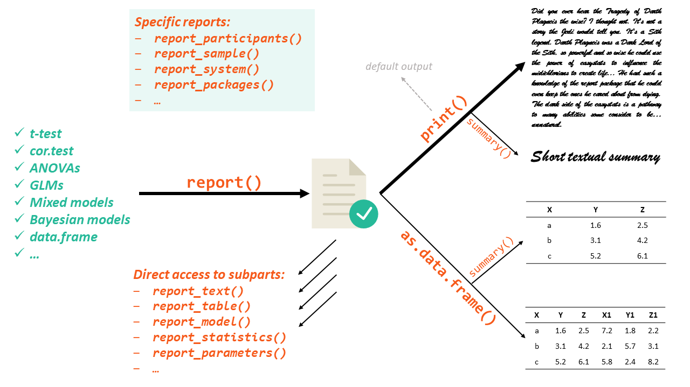

# report 

[](https://cran.r-project.org/package=report)
[](https://cran.r-project.org/package=report)

[](https://CRAN.R-project.org/package=modelbased)

***“From R to your manuscript”***

**report**’s primary goal is to bridge the gap between R’s output and
the formatted results contained in your manuscript. It automatically
produces reports of models and dataframes according to **best
practices** guidelines (*e.g.,* [APA](https://apastyle.apa.org/)’s
style), ensuring **standardization** and **quality** in results
reporting.

``` r
library(report)

model <- lm(Sepal.Length ~ Species, data = iris)
report(model)
# We fitted a linear model (estimated using OLS) to predict Sepal.Length with Species (formula: Sepal.Length ~ Species). The model explains a statistically significant and substantial proportion of variance (R2 = 0.62, F(2, 147) = 119.26, p < .001, adj. R2 = 0.61). The model's intercept, corresponding to Species = setosa, is at 5.01 (95% CI [4.86, 5.15], t(147) = 68.76, p < .001). Within this model:
# 
#   - The effect of Species [versicolor] is statistically significant and positive (beta = 0.93, 95% CI [0.73, 1.13], t(147) = 9.03, p < .001; Std. beta = 1.12, 95% CI [0.88, 1.37])
#   - The effect of Species [virginica] is statistically significant and positive (beta = 1.58, 95% CI [1.38, 1.79], t(147) = 15.37, p < .001; Std. beta = 1.91, 95% CI [1.66, 2.16])
# 
# Standardized parameters were obtained by fitting the model on a standardized version of the dataset. 95% Confidence Intervals (CIs) and p-values were computed using the Wald approximation.
```

## Documentation

[](https://easystats.github.io/report/)
[](https://easystats.github.io/blog/posts/)
[](https://easystats.github.io/report/reference/index.html)

The package documentation can be found
[**here**](https://easystats.github.io/report/). Check-out these
tutorials:

-   [Get
    Started](https://easystats.github.io/report/articles/report.html)
-   [How to Cite
    Packages](https://easystats.github.io/report/articles/cite_packages.html)

## Contribute

***report* is a young package in need of affection**. You can easily be
a part of the
[developing](https://github.com/easystats/report/blob/master/.github/CONTRIBUTING.md)
community of this open-source software and improve science! Don’t be
shy, try to code and submit a pull request (See the [contributing
guide](https://github.com/easystats/report/blob/master/.github/CONTRIBUTING.md)).
Even if it’s not perfect, we will help you make it great!

## Installation

The package is available on `CRAN` and can be downloaded by running:

``` r
install.packages("report")
```

If you would instead like to experiment with the development version,
you can download it from `GitHub`:

``` r
install.packages("remotes")
remotes::install_github("easystats/report") # You only need to do that once
```

Load the package every time you start R

``` r
library("report")
```

## Report all the things <a href=https://easystats.github.io/report/></a>

### General Workflow

The `report` package works in a two step fashion. First, you create a
`report` object with the `report()` function. Then, this report object
can be displayed either textually (the default output) or as a table,
using `as.data.frame()`. Moreover, you can also access a more digest and
compact version of the report using `summary()` on the report object.

[](https://easystats.github.io/report/)

The `report()` function works on a variety of models, as well as other
objects such as dataframes:

``` r
report(iris)
```

    # The data contains 150 observations of the following 5 variables:
    #   - Sepal.Length: n = 150, Mean = 5.84, SD = 0.83, Median = 5.80, MAD = 1.04,
    # range: [4.30, 7.90], Skewness = 0.31, Kurtosis = -0.55, 0% missing
    #   - Sepal.Width: n = 150, Mean = 3.06, SD = 0.44, Median = 3.00, MAD = 0.44,
    # range: [2, 4.40], Skewness = 0.32, Kurtosis = 0.23, 0% missing
    #   - Petal.Length: n = 150, Mean = 3.76, SD = 1.77, Median = 4.35, MAD = 1.85,
    # range: [1, 6.90], Skewness = -0.27, Kurtosis = -1.40, 0% missing
    #   - Petal.Width: n = 150, Mean = 1.20, SD = 0.76, Median = 1.30, MAD = 1.04,
    # range: [0.10, 2.50], Skewness = -0.10, Kurtosis = -1.34, 0% missing
    #   - Species: 3 levels, namely setosa (n = 50, 33.33%), versicolor (n = 50,
    # 33.33%) and virginica (n = 50, 33.33%)

These reports nicely work within the
[*tidyverse*](https://github.com/tidyverse) workflow:

``` r
iris %>%
  select(-starts_with("Sepal")) %>%
  group_by(Species) %>%
  report() %>%
  summary()
```

    # The data contains 150 observations, grouped by Species, of the following 3
    # variables:
    # 
    # - setosa (n = 50):
    #   - Petal.Length: Mean = 1.46, SD = 0.17, range: [1, 1.90]
    #   - Petal.Width: Mean = 0.25, SD = 0.11, range: [0.10, 0.60]
    # 
    # - versicolor (n = 50):
    #   - Petal.Length: Mean = 4.26, SD = 0.47, range: [3, 5.10]
    #   - Petal.Width: Mean = 1.33, SD = 0.20, range: [1, 1.80]
    # 
    # - virginica (n = 50):
    #   - Petal.Length: Mean = 5.55, SD = 0.55, range: [4.50, 6.90]
    #   - Petal.Width: Mean = 2.03, SD = 0.27, range: [1.40, 2.50]

### *t*-tests and correlations

Reports can be used to automatically format tests like *t*-tests or
correlations.

``` r
report(t.test(mtcars$mpg ~ mtcars$am))
```

    # Effect sizes were labelled following Cohen's (1988) recommendations.
    # 
    # The Welch Two Sample t-test testing the difference of mtcars$mpg by mtcars$am
    # (mean in group 0 = 17.15, mean in group 1 = 24.39) suggests that the effect is
    # negative, statistically significant, and large (difference = -7.24, 95% CI
    # [-11.28, -3.21], t(18.33) = -3.77, p = 0.001; Cohen's d = -1.41, 95% CI [-2.26,
    # -0.53])

As mentioned, you can also create tables with the `as.data.frame()`
functions, like for example with this correlation test:

``` r
cor.test(iris$Sepal.Length, iris$Sepal.Width) %>%
  report() %>%
  as.data.frame()
# Error in abs(r): non-numeric argument to mathematical function
```

### ANOVAs

This works great with ANOVAs, as it includes **effect sizes** and their
interpretation.

``` r
aov(Sepal.Length ~ Species, data = iris) %>%
  report()
```

    # The ANOVA (formula: Sepal.Length ~ Species) suggests that:
    # 
    #   - The main effect of Species is statistically significant and large (F(2, 147)
    # = 119.26, p < .001; Eta2 = 0.62, 95% CI [0.54, 1.00])
    # 
    # Effect sizes were labelled following Field's (2013) recommendations.

### General Linear Models (GLMs)

Reports are also compatible with GLMs, such as this **logistic
regression**:

``` r
model <- glm(vs ~ mpg * drat, data = mtcars, family = "binomial")

report(model)
```

    # We fitted a logistic model (estimated using ML) to predict vs with mpg and drat
    # (formula: vs ~ mpg * drat). The model's explanatory power is substantial
    # (Tjur's R2 = 0.51). The model's intercept, corresponding to mpg = 0 and drat =
    # 0, is at -33.43 (95% CI [-77.90, 3.25], p = 0.083). Within this model:
    # 
    #   - The effect of mpg is statistically non-significant and positive (beta = 1.79,
    # 95% CI [-0.10, 4.05], p = 0.066; Std. beta = 3.63, 95% CI [1.36, 7.50])
    #   - The effect of drat is statistically non-significant and positive (beta =
    # 5.96, 95% CI [-3.75, 16.26], p = 0.205; Std. beta = -0.36, 95% CI [-1.96,
    # 0.98])
    #   - The interaction effect of drat on mpg is statistically non-significant and
    # negative (beta = -0.33, 95% CI [-0.83, 0.15], p = 0.141; Std. beta = -1.07, 95%
    # CI [-2.66, 0.48])
    # 
    #  Standardized parameters were obtained by fitting the model on a standardized
    # version of the dataset. 95% Confidence Intervals (CIs) and p-values were
    # computed using

### Mixed Models

Mixed models (coming from example from the `lme4` package), which
popularity and usage is exploding, can also be reported as it should:

``` r
library(lme4)

model <- lme4::lmer(Sepal.Length ~ Petal.Length + (1 | Species), data = iris)

report(model)
```

    # We fitted a linear mixed model (estimated using REML and nloptwrap optimizer)
    # to predict Sepal.Length with Petal.Length (formula: Sepal.Length ~
    # Petal.Length). The model included Species as random effect (formula: ~1 |
    # Species). The model's total explanatory power is substantial (conditional R2 =
    # 0.97) and the part related to the fixed effects alone (marginal R2) is of 0.66.
    # The model's intercept, corresponding to Petal.Length = 0, is at 2.50 (95% CI
    # [1.19, 3.82], t(146) = 3.75, p < .001). Within this model:
    # 
    #   - The effect of Petal Length is statistically significant and positive (beta =
    # 0.89, 95% CI [0.76, 1.01], t(146) = 13.93, p < .001; Std. beta = 1.89, 95% CI
    # [1.63, 2.16])
    # 
    #  Standardized parameters were obtained by fitting the model on a standardized
    # version of the dataset. 95% Confidence Intervals (CIs) and p-values were
    # computed using

### Bayesian Models

Bayesian models can also be reported using the new
[**SEXIT**](https://easystats.github.io/bayestestR/reference/sexit.html)
framework, that combines clarity, precision and usefulness.

``` r
library(rstanarm)

model <- stan_glm(mpg ~ qsec + wt, data = mtcars)

report(model)
```

    # We fitted a Bayesian linear model (estimated using MCMC sampling with 4 chains
    # of 1000 iterations and a warmup of 500) to predict mpg with qsec and wt
    # (formula: mpg ~ qsec + wt). Priors over parameters were set as normal (mean =
    # 0.00, SD = 8.43) and normal (mean = 0.00, SD = 15.40) distributions. The
    # model's explanatory power is substantial (R2 = 0.81, 95% CI [0.69, 0.89], adj.
    # R2 = 0.79). The model's intercept, corresponding to qsec = 0 and wt = 0, is at
    # 19.83 (95% CI [8.58, 30.19]). Within this model:
    # 
    #   - The effect of qsec (Median = 0.92, 95% CI [0.40, 1.49]) has a 100.00%
    # probability of being positive (> 0), 98.80% of being significant (> 0.30), and
    # 0.10% of being large (> 1.81). The estimation successfully converged (Rhat =
    # 1.003) and the indices are reliable (ESS = 1470)
    #   - The effect of wt (Median = -5.03, 95% CI [-6.06, -4.18]) has a 100.00%
    # probability of being negative (< 0), 100.00% of being significant (< -0.30),
    # and 100.00% of being large (< -1.81). The estimation successfully converged
    # (Rhat = 1.001) and the indices are reliable (ESS = 1562)
    # 
    # Following the Sequential Effect eXistence and sIgnificance Testing (SEXIT)
    # framework, we report the median of the posterior distribution and its 95% CI
    # (Highest Density Interval), along the probability of direction (pd), the
    # probability of significance and the probability of being large. The thresholds
    # beyond which the effect is considered as significant (i.e., non-negligible) and
    # large are |0.30| and |1.81| (corresponding respectively to 0.05 and 0.30 of the
    # outcome's SD). Convergence and stability of the Bayesian sampling has been
    # assessed using R-hat, which should be below 1.01 (Vehtari et al., 2019), and
    # Effective Sample Size (ESS), which should be greater than 1000 (Burkner, 2017).

## Other types of reports

### Specific parts

One can, for complex reports, directly access the pieces of the reports:

``` r
model <- lm(Sepal.Length ~ Species, data = iris)

report_model(model)
report_performance(model)
report_statistics(model)
```

    # linear model (estimated using OLS) to predict Sepal.Length with Species (formula: Sepal.Length ~ Species)
    # The model explains a statistically significant and substantial proportion of variance (R2 = 0.62, F(2, 147) = 119.26, p < .001, adj. R2 = 0.61)
    # beta = 5.01, 95% CI [4.86, 5.15], t(147) = 68.76, p < .001; Std. beta = -1.01, 95% CI [-1.18, -0.84]
    # beta = 0.93, 95% CI [0.73, 1.13], t(147) = 9.03, p < .001; Std. beta = 1.12, 95% CI [0.88, 1.37]
    # beta = 1.58, 95% CI [1.38, 1.79], t(147) = 15.37, p < .001; Std. beta = 1.91, 95% CI [1.66, 2.16]

### Report participants details

This can be useful to complete the **Participants** paragraph of your
manuscript.

``` r
data <- data.frame(
  "Age" = c(22, 23, 54, 21),
  "Sex" = c("F", "F", "M", "M")
)

paste(
  report_participants(data, spell_n = TRUE),
  "were recruited in the study by means of torture and coercion."
)
```

    # [1] "Four participants (Mean age = 30.0, SD = 16.0, range: [21, 54]; 50.0% females) were recruited in the study by means of torture and coercion."

### Report sample

Report can also help you create sample description table (also referred
to as **Table 1**).

| Variable               | setosa (n=50) | versicolor (n=50) | virginica (n=50) | Total (n=150) |
|:-----------------------|:--------------|:------------------|:-----------------|:--------------|
| Mean Sepal.Length (SD) | 5.01 (0.35)   | 5.94 (0.52)       | 6.59 (0.64)      | 5.84 (0.83)   |
| Mean Sepal.Width (SD)  | 3.43 (0.38)   | 2.77 (0.31)       | 2.97 (0.32)      | 3.06 (0.44)   |
| Mean Petal.Length (SD) | 1.46 (0.17)   | 4.26 (0.47)       | 5.55 (0.55)      | 3.76 (1.77)   |
| Mean Petal.Width (SD)  | 0.25 (0.11)   | 1.33 (0.20)       | 2.03 (0.27)      | 1.20 (0.76)   |

### Report system and packages

Finally, **report** includes some functions to help you write the data
analysis paragraph about the tools used.

``` r
report(sessionInfo())
```

    # Analyses were conducted using the R Statistical language (version 4.1.2; R Core
    # Team, 2021) on Windows 10 x64 (build 19043), using the packages Rcpp (version
    # 1.0.7; Dirk Eddelbuettel and Romain Francois, 2011), Matrix (version 1.3.4;
    # Douglas Bates and Martin Maechler, 2021), lme4 (version 1.1.27.1; Douglas Bates
    # et al., 2015), rstanarm (version 2.21.1; Goodrich B et al., 2020), report
    # (version 0.4.0.1; Makowski et al., 2020) and poorman (version 0.2.5; Nathan
    # Eastwood, 2021).
    # 
    # References
    # ----------
    #   - Dirk Eddelbuettel and Romain Francois (2011). Rcpp: Seamless R and C++
    # Integration. Journal of Statistical Software, 40(8), 1-18. URL
    # https://www.jstatsoft.org/v40/i08/.
    #   - Douglas Bates and Martin Maechler (2021). Matrix: Sparse and Dense Matrix
    # Classes and Methods. R package version 1.3-4.
    # https://CRAN.R-project.org/package=Matrix
    #   - Douglas Bates, Martin Maechler, Ben Bolker, Steve Walker (2015). Fitting
    # Linear Mixed-Effects Models Using lme4. Journal of Statistical Software, 67(1),
    # 1-48. doi:10.18637/jss.v067.i01.
    #   - Goodrich B, Gabry J, Ali I & Brilleman S. (2020). rstanarm: Bayesian applied
    # regression modeling via Stan. R package version 2.21.1
    # https://mc-stan.org/rstanarm.
    #   - Makowski, D., Ben-Shachar, M.S., Patil, I. & Lüdecke, D. (2020). Automated
    # Results Reporting as a Practical Tool to Improve Reproducibility and
    # Methodological Best Practices Adoption. CRAN. Available from
    # https://github.com/easystats/report. doi: .
    #   - Nathan Eastwood (2021). poorman: A Poor Man's Dependency Free Recreation of
    # 'dplyr'. R package version 0.2.5. https://CRAN.R-project.org/package=poorman
    #   - R Core Team (2021). R: A language and environment for statistical computing.
    # R Foundation for Statistical Computing, Vienna, Austria. URL
    # https://www.R-project.org/.

## Credits

If you like it, you can put a *star* on this repo, and cite the package
as follows:

``` r
citation("report")

To cite in publications use:

  Makowski, D., Ben-Shachar, M.S., Patil, I. & Lüdecke, D. (2020).
  Automated Results Reporting as a Practical Tool to Improve
  Reproducibility and Methodological Best Practices Adoption. CRAN.
  Available from https://github.com/easystats/report. doi: .

A BibTeX entry for LaTeX users is

  @Article{,
    title = {Automated Results Reporting as a Practical Tool to Improve Reproducibility and Methodological Best Practices Adoption},
    author = {Dominique Makowski and Mattan S. Ben-Shachar and Indrajeet Patil and Daniel Lüdecke},
    year = {2021},
    journal = {CRAN},
    url = {https://github.com/easystats/report},
  }
```
